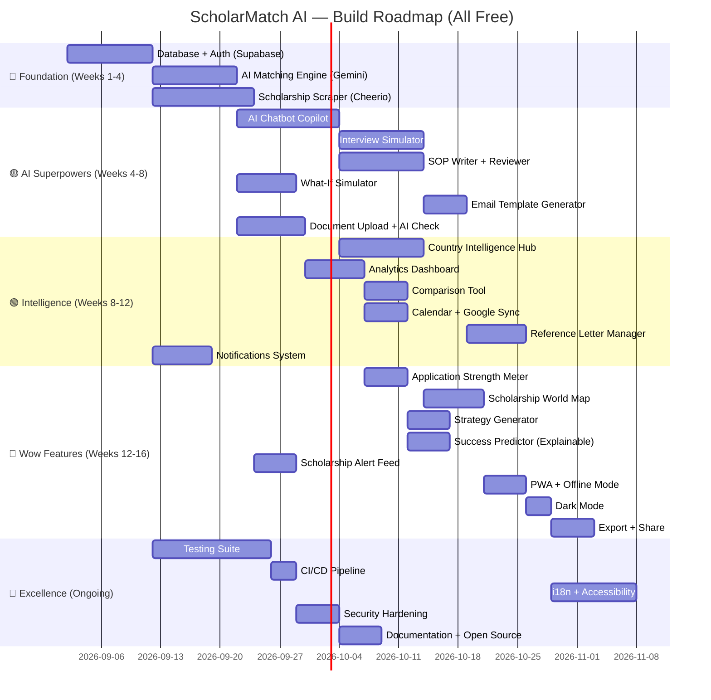

# ScholarMatch AI — Enhancement Roadmap (v2)

> **100% Free & Open-Source** — Built by a student, for students.
> A prioritized feature roadmap to transform ScholarMatch AI into the **most valuable, AI-powered scholarship platform on the internet** — and an unbeatable portfolio project.

---

## Current State Summary

| What You Have ✅ | What's Missing ❌ |
|---|---|
| Dashboard with AI match scores | No real backend — all data hardcoded in [`scholarship-data.ts`](file:///e:/study/project/download/src/lib/scholarship-data.ts) |
| Scholarship detail pages with score breakdown | No authentication — [`login.tsx`](file:///e:/study/project/download/src/routes/login.tsx) / [`signup.tsx`](file:///e:/study/project/download/src/routes/signup.tsx) are UI-only |
| Document checklist (manual toggle) | No database — state lives in `localStorage` via [`application-state.ts`](file:///e:/study/project/download/src/lib/application-state.ts) |
| Funding gap analyser | No AI — match scores are static numbers, not computed |
| Roadmap timeline | No file upload — "Upload document" button is non-functional |
| Profile page (form, no persistence) | No notifications/email — everything is display-only |
| Beautiful glassmorphism UI | No real-time scholarship data — 8 hand-written entries |

---

## 🔴 Tier 1 — Foundation (Build the Engine)

> Without these, nothing else works. These turn the UI prototype into a real application.

---

### 1. 🗄️ Real Backend + Database

**Why:** Everything is currently hardcoded in a single 734-line file. No data persists across sessions.

| Component | Tech |
|---|---|
| Database | **Supabase** (free tier: 500MB Postgres + Auth + 1GB Storage) |
| ORM | **Drizzle ORM** (type-safe, lightweight) |
| Data Fetching | **TanStack Query** (already installed) |

**Tables to create:**
```
users              → id, email, name, nationality, avatar_url, created_at
user_profiles      → user_id, gpa, ielts, degree, institution, publications, leadership, budget
scholarships       → id, name, provider, country, amount, deadline, degree, funding_type, description, eligibility_criteria (JSONB)
applications       → user_id, scholarship_id, status, saved, notes, updated_at
documents          → user_id, application_id, name, type, status, file_url, uploaded_at
notifications      → user_id, title, detail, group, read, created_at
chat_history       → user_id, role, content, created_at
```

**What changes:**
- Replace hardcoded array in [`scholarship-data.ts`](file:///e:/study/project/download/src/lib/scholarship-data.ts) with database queries
- Replace `localStorage` in [`application-state.ts`](file:///e:/study/project/download/src/lib/application-state.ts) with real API mutations
- Add TanStack Start server functions (`/api/*`) for all data operations

---

### 2. 🔐 Real Authentication

**Why:** Login and signup pages exist with beautiful UI but do absolutely nothing.

- Wire up [`login.tsx`](file:///e:/study/project/download/src/routes/login.tsx) and [`signup.tsx`](file:///e:/study/project/download/src/routes/signup.tsx) to **Supabase Auth** (free)
- OAuth providers: **Google** + **GitHub** (both free, no API costs)
- Email/password with magic link verification
- Protected routes — redirect unauthenticated users to `/login`
- Session management with Supabase's built-in JWT
- "Forgot password" flow with email reset
- Profile avatar upload to Supabase Storage

---

### 3. 🤖 AI-Powered Matching Engine (Real AI, Not Fake Numbers)

**Why:** The "AI" in "ScholarMatch AI" is currently just static percentages. This is the **core value proposition** — make it real.

**How it works:**
```
User Profile (GPA, IELTS, nationality, field, publications, leadership)
        ↓
   Matching Algorithm
        ↓
   Per-scholarship: match %, score breakdown, personalized recommendations
```

**Implementation:**
- Use **Google Gemini API** (free tier: 60 requests/min for Gemini 1.5 Flash) or **OpenAI GPT-4o-mini** (very cheap)
- Structured scoring: compare user profile fields against scholarship eligibility criteria
- Weighted multi-factor scoring: academics (35%), experience (25%), language (20%), profile fit (15%), timeline (5%)
- **Real-time re-scoring** when the user updates their profile on [`profile.tsx`](file:///e:/study/project/download/src/routes/profile.tsx)
- Cache computed scores per user-scholarship pair in the database
- Add explainability: "Your match dropped because MEXT requires Japanese language ability"

---

### 4. 🕷️ Scholarship Database + Web Scraper

**Why:** 8 hardcoded scholarships won't attract users. You need 500+.

- Build scrapers using **Cheerio** (lightweight, free) targeting:
  - Official scholarship sites (Chevening, DAAD, Erasmus, etc.)
  - Aggregators: ScholarshipDB, Scholars4Dev, StudyPortals, OpportunityDesk
- Store scraped data in the `scholarships` table
- **Admin review panel** at `/admin` to approve/reject/edit scraped entries
- **Cloudflare Workers Cron** (free tier) to refresh data weekly
- Add pagination, full-text search (Postgres `tsvector`), and advanced filtering

---

## 🟡 Tier 2 — AI Superpowers (The Differentiators)

> These features make ScholarMatch AI **unlike anything else on the internet**. This is where you flex your AI engineering skills.

---

### 5. 💬 AI Copilot Chatbot (Killer Feature 🚀)

**Why:** Every scholarship site lists opportunities. **None** give you a personal AI advisor.

**What it does:**
- "Which scholarships should I apply to first?" → personalized priority strategy
- "Help me write my SOP for Chevening" → drafts tailored to the scholarship's criteria
- "What are my weak areas?" → profile gap analysis with actionable fixes
- "Compare Chevening vs DAAD for me" → structured comparison
- "I have 3 weeks left for Chevening — what's my action plan?" → deadline-aware planning

**Implementation:**
- **Google Gemini 1.5 Flash** (free tier: 15 RPM, 1M tokens/min) as primary LLM
- RAG (Retrieval-Augmented Generation): feed scholarship data + user profile as context
- Chat history stored in `chat_history` table
- Floating chat bubble on every page + dedicated `/chat` route
- Markdown rendering in chat responses (for lists, tables, emphasis)

---

### 6. 🎤 AI Scholarship Interview Simulator ⭐ UNIQUE

**Why:** Many prestigious scholarships (Chevening, Commonwealth, Fulbright) have interviews. **No platform helps you practice.**

**What it does:**
- User selects a scholarship → AI generates realistic interview questions based on that scholarship's known criteria
- User types (or speaks via Web Speech API) their answers
- AI evaluates each answer on: relevance, specificity, impact storytelling, confidence
- Post-interview report card with scores and suggestions
- Sample strong answers for comparison
- Practice modes: "Quick 5 questions" / "Full 30-minute interview"

**Example questions for Chevening:**
> "Describe a time you demonstrated leadership and how it impacted your community."
> "Why did you choose the UK for your master's? Why not your home country?"
> "How will your Chevening experience contribute to your home country's development?"

---

### 7. 📝 AI SOP / Essay Writer & Reviewer ⭐ UNIQUE

**Why:** The #1 pain point isn't *finding* scholarships — it's *writing essays*. This alone could make your platform famous.

**Writer Mode:**
- User answers structured questions (Why this scholarship? What's your career goal? Describe leadership experience?)
- AI generates a complete first draft SOP **tailored to the specific scholarship's criteria**
- Different tone/style per scholarship (Chevening = leadership focus, DAAD = development impact, MEXT = research focus)
- Word count adherence (Chevening: 500 words, DAAD: 800 words, etc.)

**Reviewer Mode:**
- User pastes their essay → AI provides feedback:
  - ✅ Alignment with scholarship criteria (0-100%)
  - 📝 Grammar, tone, and structure suggestions
  - ⚠️ Missing elements ("You didn't mention post-study plans — Chevening weighs this heavily")
  - 📊 Readability score (Flesch-Kincaid)
- Side-by-side diff view of original vs. suggested improvements
- **Version history**: save and compare multiple drafts

---

### 8. 🔮 "What-If" Profile Simulator ⭐ UNIQUE

**Why:** Students always ask "What if I retake IELTS?" or "Will another publication help?" — give them instant answers.

**What it does:**
- Interactive sliders/inputs on a `/simulate` page:
  - "If I raise my IELTS from 7.0 → 7.5, my Chevening match goes from **92% → 97%** (+5%)"
  - "If I publish 1 more paper, my MEXT match goes from **76% → 84%** (+8%)"
  - "Adding 2 years of work experience raises DAAD from **87% → 93%** (+6%)"
- Shows impact across ALL scholarships simultaneously
- Suggests the **single highest-impact improvement** for the user's profile
- Visual before/after comparison chart

---

### 9. ✉️ AI Email Template Generator ⭐ UNIQUE

**Why:** Students waste hours writing emails to professors, referees, and scholarship offices.

**Templates for:**
- **Professor outreach** (for MEXT, research scholarships): "I'm a CSE graduate from BUET interested in your lab's work on..."
- **Reference request**: "Dear Prof. Nasrin, I'm applying for Chevening and would be grateful if you could..."
- **Follow-up reminders**: "Dear Dr. Rahman, I wanted to gently follow up on the reference letter..."
- **Scholarship office inquiries**: "I have a question about the eligibility criteria for..."
- **Post-rejection response**: "Thank you for considering my application. I would appreciate any feedback..."

**Implementation:**
- AI personalizes each email with the user's name, scholarship details, professor's research area
- Tone selector: formal / semi-formal / casual
- Copy-to-clipboard with one click
- Email send integration (optional, via Resend free tier: 100 emails/day)

---

### 10. 📄 Real Document Upload & AI Verification

**Why:** The "Upload document" button in [`documents.tsx`](file:///e:/study/project/download/src/routes/documents.tsx) currently does nothing.

- **Supabase Storage** (free: 1GB) for file uploads
- Drag-and-drop upload UI with progress bars
- Auto-categorize documents by filename/content
- **AI-powered document checks** (Gemini Vision, free tier):
  - "Your passport scan is blurry — consider re-scanning"
  - "This transcript appears to be in Bengali — some scholarships require English translations"
  - "Your CV is 4 pages — Chevening recommends 2 pages max"
- One document, multiple applications (link a passport scan to all applications)
- Generate a **document readiness report** per scholarship

---

## 🟢 Tier 3 — Intelligence & Insights

> Features that make users come back daily and tell their friends about the platform.

---

### 11. 🌍 Country Intelligence Hub ⭐ UNIQUE

**Why:** Choosing a scholarship is also choosing a country. Students need context beyond just the award amount.

**Per-country page (`/country/:code`) with:**

| Section | Data |
|---|---|
| 🎓 Education System | University rankings, degree structure, teaching style |
| 💰 Cost of Living | Rent, food, transport (real data from Numbeo API — free) |
| 🌤️ Climate & Culture | Weather patterns, cultural norms, student life |
| 🛂 Visa Process | Requirements, processing time, cost, success rates |
| 🏥 Healthcare | Student health insurance, public vs. private |
| 💼 Post-Study Work | Work permit rules, average salaries for graduates |
| 🗣️ Language | Official language, English prevalence, language courses |
| 🇧🇩 Bangladesh Community | Bangladeshi student associations, mosques, halal food |

- Interactive world map showing available scholarships per country
- "Students like you" data: where Bangladeshi BUET alumni went

---

### 12. 📊 Personal Analytics Dashboard

**Why:** Data-driven insights keep users engaged and motivated.

**Metrics:**
- **Match score trends** over time (line chart — as profile improves)
- **Application pipeline funnel**: Saved → Preparing → Submitted → Interview → Accepted/Rejected
- **Document completion velocity**: "At your current pace, you'll finish all documents in 12 days"
- **Profile strength radar chart**: academics, language, experience, documents, leadership
- **Deadline heatmap calendar**: month view showing all deadlines color-coded by urgency
- **Time invested**: track hours spent on each application

**Charts powered by Recharts** (already in your [`package.json`](file:///e:/study/project/download/src/package.json))

---

### 13. ⚖️ Side-by-Side Scholarship Comparison Tool

**Why:** Students always compare 3-5 scholarships before deciding which to prioritize.

- Add "Compare" button to each [`scholarship-card.tsx`](file:///e:/study/project/download/src/components/scholar/scholarship-card.tsx)
- Compare up to 3 scholarships side-by-side on `/compare`
- Comparison dimensions:
  - Award amount & coverage %
  - Match score & success probability
  - Deadline & urgency
  - Document requirements overlap
  - Country & degree level
  - Post-study work rights
- **Radar chart** overlay (Recharts)
- AI-generated recommendation: "Based on your profile, we recommend prioritizing Chevening over DAAD because..."

---

### 14. 📅 Smart Calendar + Google Calendar Sync ⭐ UNIQUE

**Why:** Students manage deadlines across 5-10 scholarships in their heads or scattered notes.

- Visual calendar view at `/calendar` showing all deadlines
- **Google Calendar sync** (Google Calendar API — free) — export deadlines as calendar events
- **iCal export** (.ics file download) for Apple Calendar / Outlook
- Smart reminders: auto-create events at 30 days, 14 days, 7 days, 1 day before each deadline
- Color-coded by urgency (green → yellow → orange → red)
- Milestone events from [`roadmap.tsx`](file:///e:/study/project/download/src/routes/roadmap.tsx) also appear on the calendar

---

### 15. 👥 Reference Letter Manager ⭐ UNIQUE

**Why:** Managing 3-5 referees across 8 scholarships is a logistical nightmare.

**Features:**
- Add referees: name, title, email, institution, relationship
- Track per referee: which scholarships they've been asked for, status (Requested → Accepted → Submitted)
- **Automated email reminders** to referees (Resend free tier)
- AI-generated **recommendation letter brief** — a document you send to your referee summarizing:
  - The scholarship and what it values
  - Your key achievements they should highlight
  - Suggested talking points
- Dashboard showing: "Prof. Nasrin: 2/3 letters submitted. Dr. Rahman: 0/2 — overdue by 5 days"

---

### 16. 🔔 Smart Notifications & Deadline Alerts

**Why:** Users need proactive nudges, not just a passive dashboard.

- **In-app notification center** (the bell icon already exists in the UI shell)
- Real-time notifications powered by Supabase Realtime (free)
- **Email digest** via Resend (free: 100/day):
  - "Chevening deadline in 7 days — your application is 74% ready"
  - "New scholarship matched: 88% fit"
  - "Prof. Rahman hasn't responded to your reference request — follow up?"
- **Push notifications** via Web Push API (free, no vendor needed)
- Configurable digest frequency (UI already exists in [`profile.tsx`](file:///e:/study/project/download/src/routes/profile.tsx) — just wire it up)

---

## 💎 Tier 4 — Unique & Wow Features

> These are the features that make investors, professors, and hackathon judges say "I've never seen this before."

---

### 17. 🧠 AI Application Strength Meter ⭐ UNIQUE

**Why:** Like a password strength meter, but for your scholarship application.

- Per-scholarship "Application Power Score" (0-100)
- Factors in: match score + document completeness + SOP quality + reference status + deadline proximity
- Visual meter: 🔴 Weak → 🟡 Getting There → 🟢 Strong → 💎 Outstanding
- Actionable breakdown: "Upload your SOP (+12 points) and secure your second reference (+8 points) to reach 'Strong'"
- Historical tracking: "Your Chevening strength went from 42 → 74 in the last 2 weeks"

---

### 18. 🗺️ Scholarship World Map ⭐ UNIQUE

**Why:** A visual, interactive way to explore scholarships is far more engaging than a list.

- Interactive world map (Leaflet.js / react-simple-maps — both free)
- Countries light up based on number of available scholarships
- Click a country → see all scholarships for that country
- Filters: degree level, funding type, deadline window
- Bubble size = award amount, color = match score
- "Your best matches" highlighted with special markers

---

### 19. 📱 Progressive Web App (PWA) + Offline Mode

**Why:** Students in Bangladesh (and many developing countries) have unreliable internet. Offline access is critical.

- Add `manifest.json` + service worker for PWA
- Installable on phone home screen (no app store needed)
- **Offline mode**: cache scholarship data, allow browsing and note-taking without internet
- Sync changes when back online
- Push notifications for deadlines (even when browser is closed)

---

### 20. 🌙 Dark Mode

**Why:** Students study late at night. Dark mode isn't optional anymore.

- Toggle in the header/settings
- Persist preference in user profile
- Smooth CSS transition between modes
- Respect system preference (`prefers-color-scheme: dark`)
- Already using Tailwind — add `dark:` variants to existing classes

---

### 21. 📤 Export & Share Features

**Why:** Students need to share progress with parents, advisors, and peers.

- **Export application summary as PDF** — clean, printable report per scholarship
- **Export profile as academic CV** — auto-generate a formatted CV from profile data
- **Share scholarship** via link, WhatsApp, Messenger, email
- **Export roadmap** as PDF or image for printing
- **Data export** (JSON/CSV) — full GDPR-compliant data download

---

### 22. 🏆 Scholarship Success Predictor with Explainability ⭐ UNIQUE

**Why:** "You have a 74% chance" is interesting. **Explaining WHY** is powerful.

- Beyond just a percentage — show a **SHAP-like explanation**:
  - "Your GPA contributes +18% to your success probability"
  - "Lack of work experience reduces it by -12%"
  - "Your nationality (Bangladesh) is neutral for this scholarship"
- Interactive waterfall chart showing each factor's contribution
- "How to improve" suggestions ranked by impact
- Compare your profile against **anonymized aggregated data**: "Average accepted GPA: 3.82 (yours: 3.78)"

---

### 23. 🎯 Smart Application Strategy Generator ⭐ UNIQUE

**Why:** Students don't just need to find scholarships — they need a **strategy**.

- AI analyzes all your matched scholarships and generates a personalized strategy:
  - **"Safe" bets** (high match, high success probability)
  - **"Reach" scholarships** (lower probability but worth trying)
  - **Optimal application order** based on deadlines and document overlap
  - **Time allocation**: "Spend 60% of effort on Chevening, 25% on Erasmus, 15% on DAAD"
- Factor in document reuse: "Your Chevening SOP can be adapted for Commonwealth — saves 3 days"
- Weekly strategy updates as deadlines approach

---

### 24. 📧 Scholarship Alert Feed (Personalized RSS) ⭐ UNIQUE

**Why:** New scholarships open all year. Students shouldn't have to check manually.

- AI-curated feed at `/feed` showing new scholarships that match the user's profile
- Configurable alert threshold: "Only show me scholarships with 70%+ match"
- Sources: scraped from scholarship aggregators + community submissions
- Email digest option: daily/weekly new scholarship alerts
- RSS/Atom feed URL for power users

---

### 25. ♿ Accessibility & Internationalization

**Why:** Your users are from 190+ countries. Accessibility is both ethical and practical.

**Accessibility:**
- Full keyboard navigation
- Screen reader support (ARIA labels, semantic HTML)
- High contrast mode
- Reduced motion toggle (for users with vestibular disorders)
- Focus indicators on all interactive elements

**i18n (Internationalization):**
- Integrate `react-i18next` (free)
- Priority languages: **Bengali** (🇧🇩), Hindi, Arabic, French, Spanish, Mandarin
- Language toggle in the header
- AI chatbot responds in the user's selected language

---

## 🔧 Tier 5 — Technical Excellence & Community

> These aren't user-facing features, but they make the project **production-grade** and impressive to any technical reviewer.

---

### 26. 🧪 Testing Suite

| Type | Tool | Coverage Target |
|---|---|---|
| Unit tests | **Vitest** | Core matching logic, utility functions |
| Component tests | **React Testing Library** | All form components, card interactions |
| E2E tests | **Playwright** | Login flow, application workflow, chat |
| API tests | **Vitest** | All server functions |

---

### 27. 🚀 CI/CD Pipeline

- **GitHub Actions** (free for public repos):
  - Lint (ESLint) → Test (Vitest) → Build → Deploy
  - PR previews on Cloudflare Pages
  - Automated dependency updates (Dependabot / Renovate)
- Branch protection rules on `main`
- Conventional commits + auto-changelog

---

### 28. 📚 Developer Documentation

- `CONTRIBUTING.md` — how to set up, contribute, and submit PRs
- `docs/` folder with architecture diagrams (Mermaid)
- API documentation (auto-generated from Zod schemas)
- Storybook for UI components (optional but impressive)
- Clear README with screenshots, demo link, and tech stack badges

---

### 29. 🛡️ Security Hardening

- Rate limiting on API routes (prevent abuse of AI endpoints)
- Input sanitization on all user inputs
- CSRF protection
- Content Security Policy headers
- SQL injection prevention (Drizzle ORM handles this)
- File upload validation (type, size, malware scanning)
- Supabase Row Level Security (RLS) policies — users can only access their own data

---

### 30. 🌐 Community & Open Source

**Why:** An open-source project with contributors is 10x more impressive than a solo project.

- Make the repo public on GitHub
- Add `CONTRIBUTING.md`, `CODE_OF_CONDUCT.md`, `LICENSE` (MIT)
- Create GitHub Issues for each feature (label: `good first issue`, `help wanted`)
- Set up GitHub Discussions for community Q&A
- **Feature: Community-submitted scholarships** — users can submit scholarships they find, which go through admin review
- **Feature: Success stories** — accepted students share their stats, timeline, and tips
- Star goal badges in README

---

## 🛠 Technical Debt to Fix

| Issue | Location | Fix |
|---|---|---|
| All data hardcoded in 734-line file | [`scholarship-data.ts`](file:///e:/study/project/download/src/lib/scholarship-data.ts) | Move to Supabase Postgres |
| No API routes — everything client-side | [`server.ts`](file:///e:/study/project/download/src/server.ts) | Add TanStack Start server functions |
| `localStorage` as "database" | [`application-state.ts`](file:///e:/study/project/download/src/lib/application-state.ts) | Replace with Supabase queries |
| Login/signup are UI mockups | [`login.tsx`](file:///e:/study/project/download/src/routes/login.tsx), [`signup.tsx`](file:///e:/study/project/download/src/routes/signup.tsx) | Wire to Supabase Auth |
| No form validation beyond types | [`profile.tsx`](file:///e:/study/project/download/src/routes/profile.tsx) | Add Zod validation + error messages |
| No error boundaries | All routes | Add React error boundaries per route |
| No tests | Entire project | Add Vitest + Playwright |
| No CI/CD pipeline | Repository | GitHub Actions workflow |
| No sitemap/robots.txt | Public | Auto-generate from routes |
| No rate limiting | Server | Add middleware for AI endpoints |

---

## 💰 Cost Breakdown — Everything Free

> [!IMPORTANT]
> **Every single technology below has a free tier sufficient for a student project with hundreds of users.**

| Service | Free Tier | Used For |
|---|---|---|
| **Supabase** | 500MB Postgres, 50K auth users, 1GB storage | Database + Auth + File storage |
| **Google Gemini API** | 15 RPM, 1M tokens/min (Gemini 1.5 Flash) | AI matching, chatbot, SOP writer, interview sim |
| **Resend** | 100 emails/day, 3000/month | Email notifications + referee reminders |
| **Cloudflare Workers** | 100K requests/day | Hosting + cron jobs for scraping |
| **Cloudflare Pages** | Unlimited sites, unlimited bandwidth | Frontend hosting |
| **GitHub Actions** | 2000 min/month (public repos unlimited) | CI/CD pipeline |
| **Vercel** (alternative) | 100GB bandwidth, serverless functions | Alternative hosting |
| **Numbeo API** | Free tier | Cost of living data |
| **Web Push API** | Free (browser-native) | Push notifications |
| **Leaflet.js** | Free & open-source | Interactive world map |
| **react-i18next** | Free & open-source | Multi-language support |

**Total monthly cost: $0.00** 🎉

---

## Implementation Timeline



---

## Tech Stack — Final

| Layer | Technology | Cost |
|---|---|---|
| **Framework** | TanStack Start + Vite (current) | Free |
| **Language** | TypeScript (current) | Free |
| **UI** | Radix + shadcn/ui + Tailwind v4 (current) | Free |
| **Database** | Supabase (Postgres) | Free |
| **Auth** | Supabase Auth | Free |
| **AI/LLM** | Google Gemini 1.5 Flash | Free |
| **File Storage** | Supabase Storage | Free |
| **Email** | Resend | Free |
| **Hosting** | Cloudflare Pages + Workers | Free |
| **Scraping** | Cheerio + node-cron | Free |
| **Maps** | react-simple-maps / Leaflet | Free |
| **Charts** | Recharts (current) | Free |
| **Calendar** | Google Calendar API | Free |
| **i18n** | react-i18next | Free |
| **Testing** | Vitest + Playwright | Free |
| **CI/CD** | GitHub Actions | Free |
| **Push** | Web Push API (browser-native) | Free |

---

## What Makes This Project Stand Out (Portfolio/Resume Value)

> [!TIP]
> When presenting this project in interviews or on your resume, emphasize these technical highlights:

| Skill Demonstrated | Feature |
|---|---|
| **AI/ML Engineering** | Real matching engine, RAG chatbot, SOP generator, interview simulator |
| **Full-Stack Development** | Supabase backend, auth, file storage, TanStack Start SSR |
| **Web Scraping & Data Engineering** | Automated scholarship scraper with cron pipeline |
| **System Design** | Multi-tenant architecture, caching strategy, rate limiting |
| **Frontend Excellence** | Glassmorphism UI, Recharts dashboards, interactive maps, dark mode |
| **DevOps** | CI/CD pipeline, Cloudflare deployment, monitoring |
| **Security** | Auth, RLS policies, input sanitization, CSRF protection |
| **Open Source Leadership** | Contributing guide, issue management, community features |
| **Accessibility** | WCAG compliance, screen reader support, keyboard navigation |
| **Product Thinking** | Solving a real problem for real users (scholarship applicants) |

---

> [!IMPORTANT]
> **Bottom line:** With 30 features, all free, covering AI, full-stack, scraping, maps, real-time, PWA, and security — this project alone can carry your entire resume. Start with Tier 1 (database + auth + AI matching), then build outward. Every feature you add makes the next demo more impressive.
